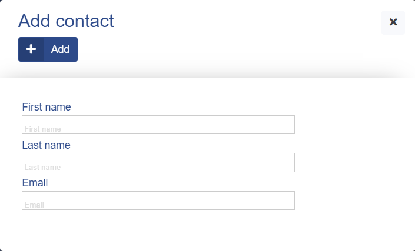

# Designing forms

The [Form](../5.%20Views/Form.md) view contains a flexible and easy-to-configure templating engine that can render complex forms for inserting or editing records in a [model](../6.%20Database/Model.md). The definition of the template can contain:

  * inputs to the columns of a model based on its [data type](../6.%20Database/Data%20types.md);
  * columns
  * tabs
  * custom fields
  * custom buttons (by default, the `Save`, `Delete` and `Close` buttons are rendered)

In this chapter, we will learn how to configure the template.

## Configuring the template

The configuration of the template is done by providing a `model` and `template` parameters to the [Form](../5.%20Views/Form.md) view:

```php
$theForm = new \ADIOS\Core\Views\Form(
  $adios,
  [
    'model' => 'App/Widgets/AddressBook/Models/Contact',
    'template' => [
      'first_name',
      'last_name',
      'email',
    ],
  ]
)
```

The `model` parameter is for necessary to get the list of available columns.

## Hello world example

The easiest configuration of the form's template is to provide the list of columns which we want to render into the form, in a form of an array.

As shown in the previous example, the form with this configuration would look like this:



