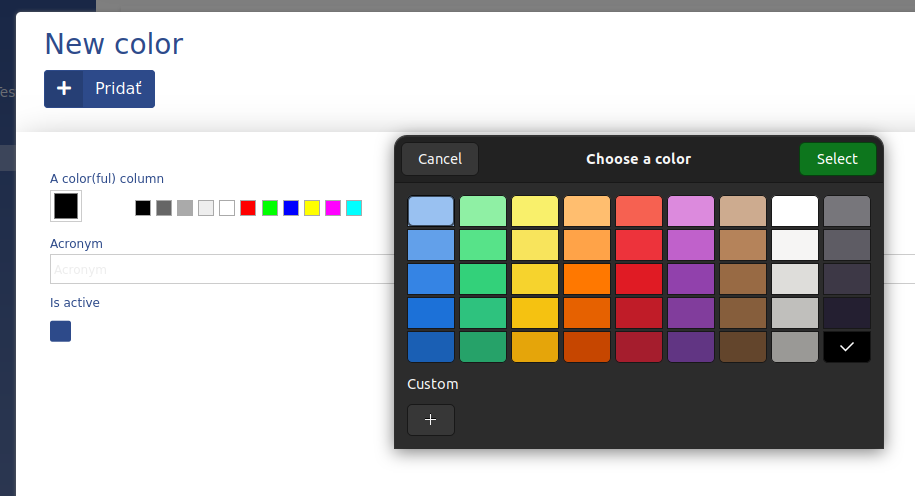

# Color

This data type represents a color in ADIOS. It is saved as a **char(10)**.  


> :bulb: When you render the data type in a form, you can choose from a set of predefined colors or even choose your own by clicking the selected color on the left (an OS/browser built-in color picker pops up)

**Properties**
- default value: ''

## Parameters

| Parameter Name  | Used in          | Default value | Description |
| --------------- | ---------------- | ------------- | ----------- |
| sql_definitions | create SQL table |               |             |
## Example

```php
"columnName" => [  
	"type" => "color",  
	"title" => "A Color(ful) Column",  
	"show_column" => TRUE,  
]
```