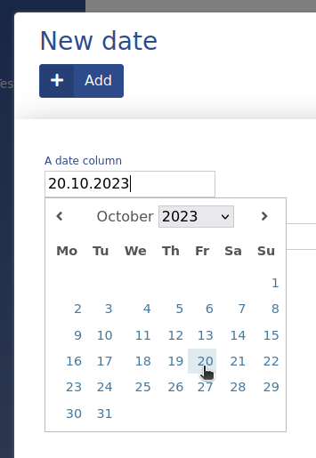

# Date

Date is an ADIOS data type to display dates. It is saved in the SQL database as **date**.

> :bulb: **Prototype builder tip:** Date columns must end with *\_date*

> :bulb: The date column is rendered as an input text box. By clicking it, an ADIOS menu pops up to let you choose the desired date.

**Properties:**
- **Default value:** null (unless specified otherwise)

| Parameter Name  | Used in          | Default value | Description                                      |
| --------------- | ---------------- | ------------- | ------------------------------------------------ |
| sql_definition  | create SQL table |               | Additional SQL definitions to be specified       |
| required        | create SQL table | false         | Determines whether the column should be required |
| format          | form + table     | null          | Determines the PHP format of displaying the date |
