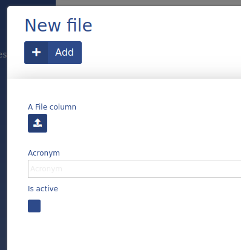
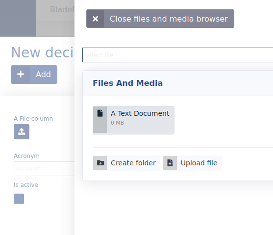

# File

This data type is used in ADIOS to upload and store files. All uploaded files are stored in the upload folder in the blade root. The SQL database only stores the name of the selected file as a **varchar(255)**.




> :bulb: After selecting the action button when viewing the File data type as an Input, a small menu opens with the option of selecting a previously uploaded file or uploading a new one.

**Properties:**
- default value: ''

| Parameter Name  | Used in          | Default value | Description                                                    |
| --------------- | ---------------- | ------------- | -------------------------------------------------------------- |
| sql_definitions | create SQL table |               | Additional SQL definitions to be used when creating the column |

## Example

```php
"columnName" => [  
      "type" => "file",  
      "title" => "A File Column",  
      "show_column" => true,  
]
```