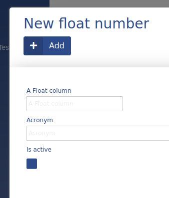

# Float

Float data type is used to store and display decimal numbers in ADIOS. It is saved as type **double** in SQL. If *required* is not defined, then the default value will be null.



### Parameters

| Parameter Name  | Used in          | Default value     | Description                                                                         |
| --------------- | ---------------- | ----------------- | ----------------------------------------------------------------------------------- |
| sql_definitions | create SQL table |                   | Additional SQL definitions to be used when creating the column                      |
| byte_size       | create SQL table |                   | Defines the size limit of the number                                                |
| decimals        | create SQL table | 1                 | How many decimal places should be stored                                            |
| sql_data_type   | create SQL table | double            | Defines how the data type should be saved in SQL (double, float, decimal, numberic) |
| required        | form             | false             | Defines if the field should be able to be null or not                               |
| escape_string   | insert, update   | defined in config | Defines the escape string |
| format          | table            |                   | Defines how the value should be formatted (use VALUE in place of the column value) |
| unit            | table, form      |                   | Defines the unit of the value |
| dumping_data    | table, form      | false             | |
| null_value      | table, form      | false             | Sets the display value of the column to NULL |

### Example


```php
"columnName" => [  
	"type" => "float",  
	"title" => "A Float Column",  
	"show_column" => TRUE,
	"unit" => "kg",
	"decimals" => 2  
]
```
