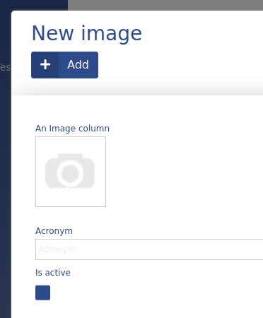
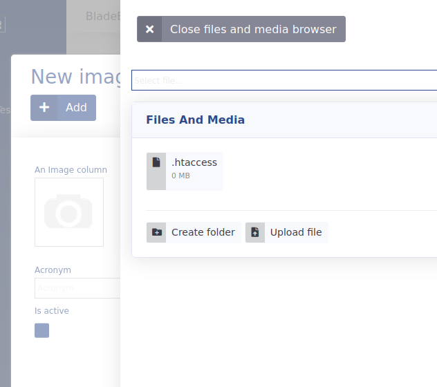

# Image

This data type is used in ADIOS to upload and store images. All uploaded images are stored in the upload folder in the blade root. The SQL database only stores the name of the selected file as a **varchar(255)**.




> :bulb: After selecting the image button when viewing the Image data type as an Input, a small menu opens up with the option of selecting a previously uploaded file or uploading a new one.

The data type is actually very similar to the File data type with the exception, that the Image data type is more adapted for viewing images and is able to display a preview of the uploaded image.

**Properties:**
- default value: ''

| Parameter Name | Used in | Default value | Description |
| --------------- | ---------------- | ----------------- | -------------------------------------------------------------------------------|
| sql_definitions | create SQL table | | Additional SQL definitions to be used when creating the column |
| dumping_data | table, form | false | |
| null_value | table, form | false | Sets the display value of the column to NULL |
| supported_extensions | insert + update | defined in config | Defines the supported extensions by this data type |
| escape_string | | defined in config | Defines the escape string |

## Example

```php
"columnName" => [  
      "type" => "image",  
      "title" => "An Image Column",  
      "show_column" => true,  
]
```