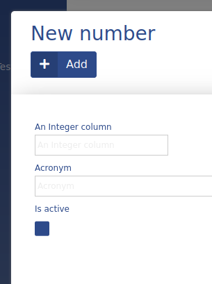

# Integer

This ADIOS data type is used to save whole numbers. It is stored as an **int** in the SQL database, its size can be modified by the `byte_size` parameter.



**Properties:**
- default value: **null**
### Enum values

When specifying the `enum_values` property, the data type turns into an Enum and acts as a select.

![[int_enum.png]]

## Parameters

| Parameter Name | Used in | Default value | Description |
| --------------- | ---------------- | ----------------- | ----------------------------------------------------------------------------------- |
| sql_definitions | create SQL table | | Additional SQL definitions to be used when creating the column |
| byte_size | create SQL table | | Defines the size limit of the number |
| required | form | false | Defines if the field should be able to be null or not |
| format | table | | Defines how the value should be formatted (use  in place of the column value) |
| unit | table, form | | Defines the unit of the value |
| enum_values | table, form | not defined by default | when present makes the column act as an enum |

## Examples

**#1** Basic int column
```php
"columnName" => [
	"type" => "int",
	"title" => "An Int Column",
	"show_column" => TRUE,
	"byte_size" => 11,
	"unit" => "#",
]
```

**#2** An enum column

```php
"columnName" => [
	"type" => "int",
	"title" => "An Enum Column",
	"enum_values" => ['Red','Green','Blue']
	"show_column" => TRUE,
]
```