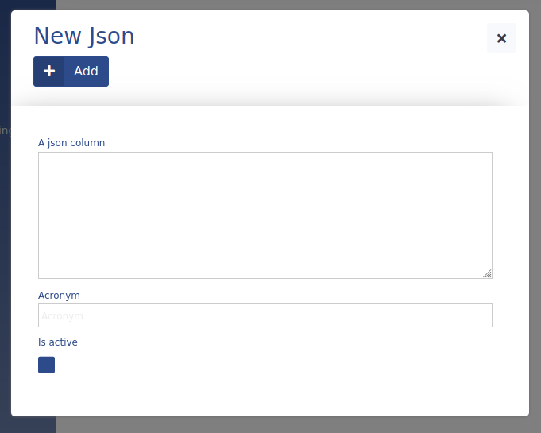

# Json (Text)

This data type is used to save multiline text in ADIOS. It is rendered as **textarea** by **UI/Input** and stored as **json** in SQL.

> ⚠️ The column type keyword for Prototype builder for this data type is **text**, not json. Check the examples.



There are no addition SQL **properties** specified by default. You can however define them yourself by utilizing the **sql_definitions** parameter.

## Parameters

| Parameter Name  | Used in          | Default value | Description |
| --------------- | ---------------- | ------------- | ----------- |
| sql_definitions | create SQL table |               | Additional SQL definitions to be specified |
## Example

```php
"columnName" => [  
	"type" => "text",  
	"title" => "A Json Column",  
	"show_column" => TRUE,  
]
```