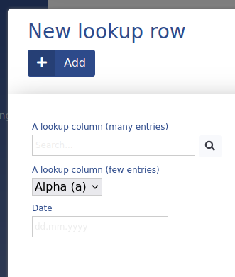

# Lookup

This ADIOS data type is used to link to other Models. In the SQL database is it save as an **int(8)**.
It is render as a *select* HTML element by **UI/Input**. In case there are many entries and the *select* would look very confusing, it automatically switches to an *autocomplete*, when there are more than 10 entries available. 
The text used to represent each row is configured by the **lookupSqlValue** property of the Model of the row.


> :bulb: The autocomplete text for many entries is a search field that automatically suggests the most likely entries based on your search query.

**Properties:**
- default value: **null** or **0** (based on whether the foreign model has the parameter **disable_foreign_key**)
- the value stored in this column is the ID of the foreign row
## Parameters

| Parameter Name | Used in | Default value | Description |
| --------------- | ---------------- | ----------------- | ----------------------------------------------------------------------------------- |
| sql_definitions | create SQL table | | Additional SQL definitions to be used when creating the column |
| input_style | forms | determined automatically | Enforces an input style (autocomplete, select) |
| model | create SQL table | Path to the foreign model |

> :bulb: For Prototype builder to successfully build the column, it is required, that its name starts with `id_`. It is also required (and very essential) that the **model** parameter is always specified.
## Examples

**#1** Basic lookup column
```php
"lookupColumn" => [
	"type" => "lookup",
	"title" => "Associated row",
	"model" => "App\Widgets\Path\To\Model"
	"show_column" => TRUE
]
```