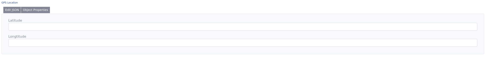

# DataTypeMapPoint

This is a special ADIOS type defined as MapPoint. It is saved as a **json** in the SQL database. Json consists of two parameters namely **latitude** and **longitude**.


> :bulb: Rendered output of the MapPoint is provided by [JSON Editor library](https://github.com/json-editor/json-editor). 

**Properties**
- default value: '{"latitude": 0,"longitude": 0}'
- NOT NULL

The **View/Input** renders this data type as a checkbox.

## Parameters
| Name  | Type   | Description         |
|-------|--------|---------------------|
| sql_definitions | string | Additional SQL parameters to be supplied when creating the column, optional |


## Example 1
A column with the datatype MapPoint may be defined for e.g.:

```php
"gps_location" => [
  "type" => "MapPoint",
  "title" => "GPS Location"
]
```
