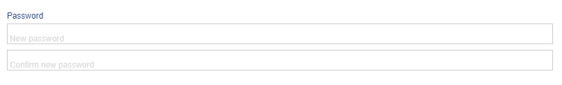

# Password

Password is an ADIOS data type to create input boxes for password validation. It is saved in the SQL database as **varchar**. The password data type is saved in a hashed string.



> 💡 The password column renders two input boxes, one for a password and one for the repeat of the password for validation. If the passwords in these input boxes don't match the boxes will become red.

**Properties:**
- **Default value:** null (unless specified otherwise)

| Parameter Name  | Used in          | Default value | Description                                      |
| --------------- | ---------------- | ------------- | ------------------------------------------------ |
| sql_definition  | create SQL table |               | Additional SQL definitions to be specified       |
| byte_size          | create SQL table     | 255 | Byte size of the allowed input string |
| required        | create SQL table | false         | Determines whether the column should be required |

```php
"columnName" => [  
	"type" => "password"
]
```
