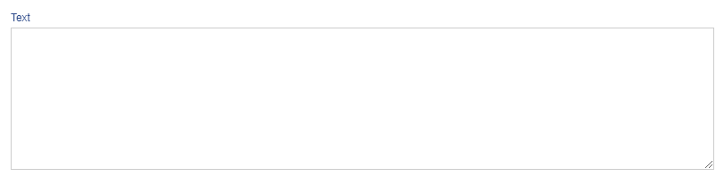

# Text

Text is an ADIOS data type to display longer text. It is saved in the SQL database as **text**.



> 💡 The text column is rendered as a text area where you can enter your text.

**Properties:**
- **Default value:** null (unless specified otherwise)

| Parameter Name  | Used in          | Default value | Description                                      |
| --------------- | ---------------- | ------------- | ------------------------------------------------ |
| sql_definition  | create SQL table |               | Additional SQL definitions to be specified       |
| sql_data_type  | create SQL table | text | Specific data type of the text data type **Options:** `["tinytext", "text", "mediumtext", "longtext"]`  |
| required        | create SQL table | false         | Determines whether the column should be required |

```php
"columnName" => [  
	"type" => "text",
	"sql_data_type" => "longtext",
	"show_column" => TRUE,  
]
```
