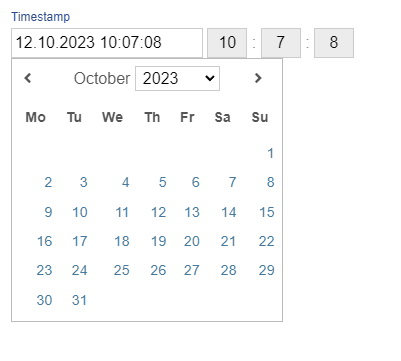

# Timestamp

Timestamp is an ADIOS data type to display timestamps. It is saved in the SQL database as **timestamp**.

> 💡 The timestamp column is rendered as an input text box. By clicking it, an ADIOS menu pops up to let you choose the desired date. You can specify the time of the timestamp by clicking and dragging the three input boxes on the right to add or substract the time.

**Properties:**
- **Default value:** null (unless specified otherwise)

| Parameter Name  | Used in          | Default value | Description                                      |
| --------------- | ---------------- | ------------- | ------------------------------------------------ |
| sql_definition  | create SQL table |               | Additional SQL definitions to be specified       |
| required        | create SQL table | false         | Determines whether the column should be required |
| format          | form + table     | 'd.m.Y H:i:s' | Determines the PHP format of displaying the timestamp |
