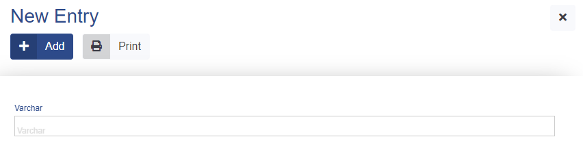

# Varchar

This data type represents a varchar in ADIOS. It is saved as a **varchar** in the SQL database.  

> 💡 When you render the Varchar data type in a form, the Varchar column is rendered as an input text box where you can enter text.



**Properties**
- default value: ''

## Parameters

| Parameter Name  | Used in          | Default value | Description |
| --------------- | ---------------- | ------------- | ----------- |
| sql_definitions | create SQL table |               | Additional SQL definitions to be specified |
| null_value          | create SQL table     | false | Determines if NULL value is allowed in the column of the SQL table |
| byte_size          | create SQL table     | 255 | Byte size of the allowed input string |
| required          | create SQL table, form + table     | false | Determines if the column is required |
## Example

```php
"columnName" => [  
	"type" => "varchar",
	"byte_size" => 100,
	"required" => TRUE,
]
```