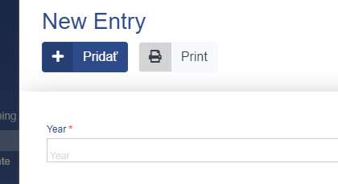

# Year

This data type represents a year in ADIOS. It is saved as a **year** in the SQL database.  

> 💡 When you render the Year data type in a form, the Year column is rendered as an input text box where you can enter a specific year.



**Properties**
- default value: '00:00:00'

## Parameters

| Parameter Name  | Used in          | Default value | Description |
| --------------- | ---------------- | ------------- | ----------- |
| sql_definitions | create SQL table |               | Additional SQL definitions to be specified |
| null value          | create SQL table     | false | Determines if NULL value is allowed in the column of the SQL table |
| required          | create SQL table, form + table     | false | Determines if the column is required |
## Example

```php
"columnName" => [  
	"type" => "year",
	"show_column" => TRUE,  
]
```