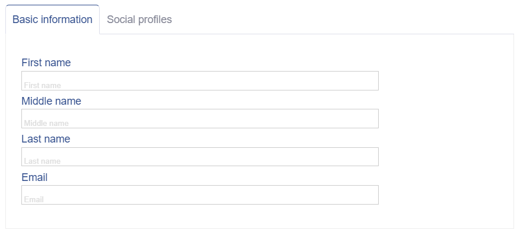

# Designing forms

The [Form](../5.%20Views/Form.md) view contains a flexible and easy-to-configure templating engine that can render
complex forms for inserting or editing records in a [model](../6.%20Database/Model.md). With this templating engine and
only a little coding, you will be able to create complex forms for manipulating your data.

The definition of the Form can contain:

  * inputs to the columns of a model based on its [data type](../6.%20Database/Data%20types.md);
  * lookups
  * groups of inputs
  * columns
  * tabs
  * custom fields
  * custom buttons (by default, the `Save`, `Delete` and `Close` buttons are rendered)
  * custom views

In this chapter, we will learn how to configure it.

## Configuring the Form

The configuration of the form is done by providing a `model` and `template` or `content` parameters to the
[Form](../5.%20Views/Form.md) view:

```php
$theForm = new \ADIOS\Core\Views\Form(
  $adios,
  [
    'model' => 'App/Widgets/AddressBook/Models/Contact',
    'template' => [
      'first_name',
      'last_name',
      'email'
    ]
  ]
)
```

> :bulb: Check the `AddressBook/Contact/Add-Version1` action in the 
> [AddressBook.yml](../../resources/examples/prototype-builder-yaml/AddressBook.yml)

> :bulb: You can create a .yml file with the definition of the template and use the 
> [`prototype builder`](./Prototype%20builder.md) feature to generate the source code from the command line.

The `model` parameter is used to get the list of available columns and their properties (data type, title, ...).


## Hello world example

The easiest configuration of the form's template is to provide the list of columns which we want to render into the
form, in a form of an array. The form with the configuration from the previous example would be rendered by like this:


You only need to launch the `render()` method:

```php
echo $theForm->render();
```

## Using model's configuration to render a form

You may ask where the other information like the window title or the titles of the inputs come from. The answer is: from
a [model](../6.%20Database/Model.md). The *model* contains several properties used by forms, e.g.:

  * formTitleForInserting
  * formTitleForEditing

Additionaly, the definition of model's columns (provided by the `columns()` method of model) contains some other
information used in rendering of the form, e.g.:

  * type
  * title
  * unit

Check [\ADIOS\Core\Model class](https://github.com/wai-blue/ADIOS/blob/main/src/Core/Model.php) for the list of all
properies used.

## Rendering views inside a form

Sometimes you need to include more complex views inside a form. A typical example is a table with the list of associated
records.

This can be achieved by using the `content` property, which renders another view inside. In combination with the Grid 
view and other nested views, you are able to reach the desired result. In the example below, the view
[Table](../5.%20Views/Table.md) will be rendered.

```php
$theForm = new \ADIOS\Core\Views\Form(
  $adios,
  [
    'model' => 'App/Widgets/AddressBook/Models/Contact',
    'content' => [
      'view' => 'ADIOS/Core/Views/Grid',
      'params' => [
        'layout' => ['A B', 'C C'],
        'layoutSm' => ['A', 'B', 'C'],
        'cssClass' => 'no-area-borders',
        'areas' => [
          'A' => ['item' => 'first_name'],
          'B' => ['item' => 'last_name'],
          'C' => [
            'item' => [
              'view' => 'Table',
              'params' => [
                'model' => 'App/Widgets/AddressBook/Models/ContactAddress',
                'where' => [
                  'id_contact',
                  '=',
                  $this->params['id'],
                ]
              ]
            ]  
          ]   
        ] 
      ]
    ]
  ]
)
```

## More complex examples

### Tabs

Let's imagine, the model for storing the contacts could be far more complex and could contain lots of columns, somehow
logically grouped. In such case, you may want to render a form using tabs. With the form's templating engine, this is
very simple.

For example, this configuration of the template:

```php
$theFormWithTabs = new \ADIOS\Core\Views\Form(
  $adios,
  [
    'model' => 'App/Widgets/AddressBook/Models/Contact',
    'template' => [
      'columns' => [
        [
          'tabs' => [
            'Basic information' => [
              'first_name',
              'middle_name',
              'last_name',
              'email'
            ],
            'Social profiles' => [
              'url_facebook',
              'url_linkedin'
            ]
          ]
        ]
      ]
    ]
  ]
)
```

> :bulb: Check the `AddressBook/Contact/Add-Version2` action in the 
> [AddressBook.yml](../../resources/examples/prototype-builder-yaml/AddressBook.yml)


Would end up with the form rendered followingly:



### Grouping inside a tab

```php
$theFormWithTabs = new \ADIOS\Core\Views\Form(
  $adios,
  [
    'model' => 'App/Widgets/AddressBook/Models/Contact',
    'template' => [
      'columns' => [
        [
          'tabs' => [
            'Basic information' => [
              'group' => [
                'title' => 'Full name',
                'items' => [
                  'first_name',
                  'middle_name',
                  'last_name'
                ],
              ],
              'group' => [
                'title' => 'Contact details',
                'items' => [
                  'email',
                  'phone'
                ]
              ]
            ],
            'Social profiles' => [
              'url_facebook',
              'url_linkedin'
            ]
          ]
        ]
      ]
    ]
  ]
)
```

> :bulb: Check the `AddressBook/Contact/Add-Version3` action in the 
> [AddressBook.yml](../examples/prototype-builder-yaml/AddressBook.yml)


### Multiple columns

To add more columns to a form, use the Grid view:

```php
$theFormWithTabs = new \ADIOS\Core\Views\Form(
  $adios,
  [
    'model' => 'App/Widgets/AddressBook/Models/Contact',
    'content' => [
      'view' => 'ADIOS/Core/Views/Tabs',
      'params' => [
        'tabs' => [
          [
            'title' => 'Basic information',
            'content' => [
              'view' => '/ADIOS/Core/Views/Grid',
              'params' => [
                'layout' => ['A B', 'C D'],
                'areas' => [
                  'A' => ['item' => 'first_name'],
                  'B' => ['item' => 'middle_name'],
                  'C' => ['item' => 'last_name'],
                  'D' => ['item' => 'email']
                ]
              ]
            ]
          ],
          [
            'title' => 'Social profiles',
            'content' => [
              'view' => '/ADIOS/Core/Views/Grid',
              'params' => [
                'layout' => ['A B'],
                'areas' => [
                  'A' => ['item' => 'url_facebook'],
                  'B' => ['item' => 'url_linkedin'],
                ]
              ]
            ]
          ]
        ]   
      ]   
    ]
  ]
)
```

### Tables linked via foreign keys (lookups)

Let's have a form to edit the contact and each contact can have several addresses associated.

In this case, you would have two models:

  1. `\App\Widgets\AddressBook\Models\Contact` to store the basic information about the contact like `first_name`, `last_name` or `email`.
  2. `\App\Widgets\AddressBook\Models\ContactAddress` to store the associated addresses. This model would contain a *lookup* column `id_contact` - the foreign key to the Contact.

The easiest way how to build a UI to manage this dataset, is to create a form for the `Contact` model, containing a
table with the list of associated records from the `ContactAddress` model. And to make the form nice looking, we will
split the form into two tabs, one for the contact details and the second for the table.

```php
$theForm = new \ADIOS\Core\Views\Form(
      $adios,
      [
        'model' => 'App/Widgets/AddressBook/Models/Contact',
        'content' => [
          'view' => 'ADIOS/Core/Views/Tabs',
          'params' => [
            'tabs' => [
              [
                'title' => 'Basic information',
                'content' => [
                  'view' => 'ADIOS/Core/Views/Grid',
                  'params' => [
                    'title' => 'Full name',
                    'layout' => ['A', 'B', 'C'],
                    'areas' => [
                      'A' => ['item' =>
                        [
                          'view' => 'ADIOS/Core/Views/Grid',
                          'params' => [
                            'title' => 'Full name',
                            'layout' => ['A', 'B', 'C'],
                            'areas' => [
                              'A' => ['item' => 'first_name'],
                              'B' => ['item' => 'middle_name'],
                              'C' => ['item' => 'last_name']
                            ]
                          ]
                        ]
                      ],
                      'B' => ['item' =>
                        [
                          'view' => 'ADIOS/Core/Views/Grid',
                          'params' => [
                            'title' => 'Contact details',
                            'layout' => ['A', 'B'],
                            'areas' => [
                              'A' => ['item' => 'email'],
                              'B' => ['item' => 'phone']
                            ]
                          ]
                        ]
                      ],
                      'C' => ['item' =>
                        [
                          'view' => 'ADIOS/Core/Views/Grid',
                          'params' => [
                            'title' => 'Social media',
                            'layout' => ['A', 'B'],
                            'areas' => [
                              'A' => ['item' => 'url_facebook'],
                              'B' => ['item' => 'url_linkedin']
                            ]
                          ]
                        ]
                      ]
                    ]
                  ]
                ]
              ],
              [
                'title' => 'Addresses',
                'content' => [
                  'view' => 'ADIOS/Core/Views/Table',
                  'params' => [
                    'model' => 'App/Widgets/AddressBook/Models/ContactAddress',
                    'where' => [
                      'id_contact',
                      '=',
                      $this->params['id'],
                    ]
                  ]
                ]
              ]
            ]
          ]
        ]
      ]
    );
```

> :bulb: Check the `AddressBook/Contact/Edit-Version2` action in the [AddressBook.yml](../../resources/examples/prototype-builder-yaml/AddressBook.yml)


### Inputs based on lookup models

`id_com_contact_person:LOOKUP:title_before`

