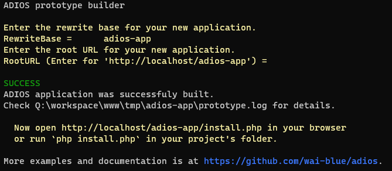

# ADIOS - documentation

You've arrived at the right place to explore the documentation for the [ADIOS](https://github.com/wai-blue/ADIOS) framework.

We prepared for you ADIOS documentation in two versions, now it's on you, which option you use:

1. [Static website for browsing all markdown files in one place](https://wai-blue.github.io/adios-docs/)
2. [adios-docs repository content is ready for you to browse markdown files on your own](https://github.com/wai-blue/adios-docs)

## About adios

Adios is a powerful ight-weight rapid application development framework for PHP 8.

Easy to use and completely free.

## Create your first CRM application (in a few minutes)

To begin your journey with ADIOS, follow these steps:  

1. Go to the desired location, where you want to create or save your project within it.
2. Now you need only these simple commands to create your first CRM application:

For linux:
```
composer create-project wai-blue/adios-app
cd adios-app
./bin/build.sh
```

For windows:
```
composer create-project wai-blue/adios-app
cd adios-app
cd bin
build.bat
```



This will create an ADIOS application based on the [simple-crm.json prototype](https://github.com/wai-blue/ADIOS/blob/main/docs/Prototype/examples/10-simple-crm.json) which you can further customize.

Sounds interesting? The documentation will always be available here, ready for you.

## Want to contribute?

ADIOS is an open-source MIT licensed framework. You can use it for free for both personal and commercial projects.

We will be happy for any contributions to   the project:

  * UI componets
  * Language dictionaries
  * Skins
  * Plugins
  * Prototype builder templates
  * Sample applications
  * Documentation
  * Unit tests
  * And anything else...

Enjoy!

## Want to donate? Buy us a beer.

Thank you :-)
