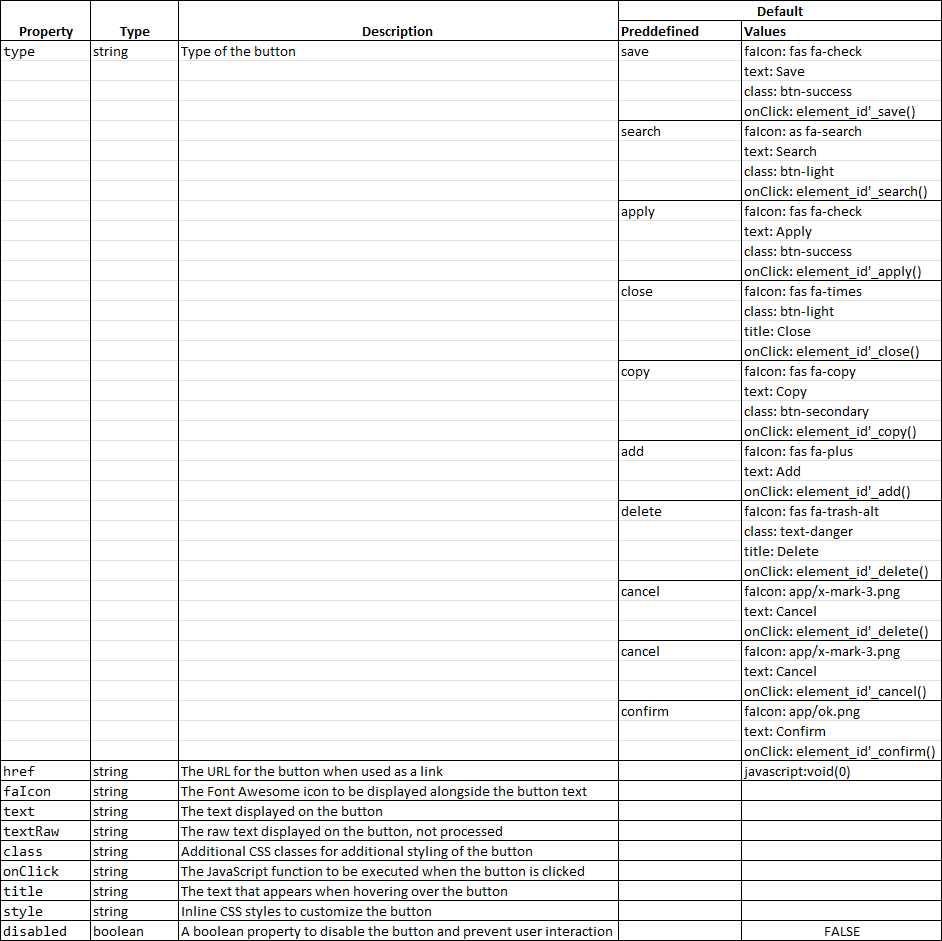

# Button

The Button component in ADIOS provides a interactive element that allows users to trigger specific actions or events within the application.

## Properties

The Button component supports various properties that can be utilized to meet specific design and functionality requirements:



## Usage

1. Ensure that you have correctly followed the structure of the prototype builder.
2. Place the button component in the desired location within your .yml file hierarchy.
3. Define the necessary properties for the button according to your requirements.

```
array (
    'view' => 'Button',
        'params' => [
            'title' => 'button title',
            'text' => 'some text in the button',
        ],
    ),
```

## Examples

Will be added later...

## Notes

1. Each supported type of button has a predefined Font Awesome icon corresponding to its type, as well as properties for 'type', 'class', and 'onClick'.
